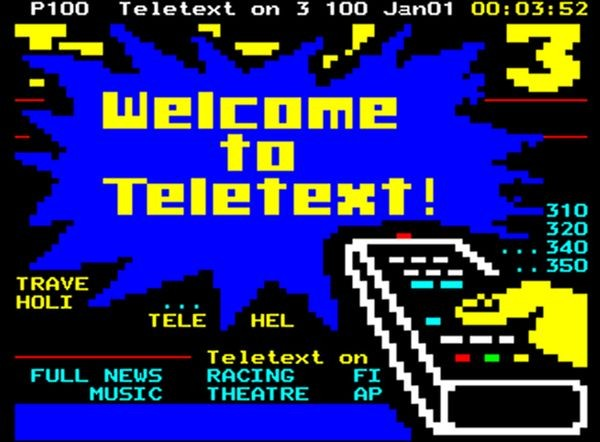

<div align="center">
<h1 align="center">Teletext</h1>
<h4>The only way to inform yourself!</h4>
<hr>

</div>

## Description
Teletext is a multi users UDP application who looks like the ancien teletext. You can connect to the teletext server and check news on various subjects. The app use the Teletext protocol, you can find the information about it [here.](/docs/PROTOCOL.md)


## Building the app
The app use maven  so in order to build and package the app use this command.

```sh
# Download the dependencies
./mvnw dependency:resolve

# Package the application
./mvnw package
```

## Running the app
Download the .jar file into the lastest [release]() and run the command explained under this text. 
You can also download the source code and build the code with Maven but make sure to have included all dependencies.

### Launch the teletext server

```sh
java -jar <path-to-jar> server

# Example
java -jar Teletext-v1.0.jar server
```
### Launch a news emiter 

```sh
java -jar <path-to-jar> emitter <type> [weather, heig, politic, sport]

# Example
java -jar Teletext-v1.0.jar emitter sport
```

### Launch a client

```sh
java -jar <path-to-jar> client

# Example
java -jar Teletext-v1.0.jar client
```


## Docker and Docker compose
If you want you can use Docker to run the application. You juste will have to package the jar file by using maven.

### Clone the repository: 
```sh
git clone https://github.com/truebguillaume/Teletext.git
```

Then go to the project directory and package the app with maven to get the jar file.


### Package the project
```sh
# Download the dependencies
./mvnw dependency:resolve

# Package the application
./mvnw package
```

After that you will be able to build a Docker image.

### Build the image
```sh
docker build -t ghcr.io/<your_github_account>/teletext .
```

### Run the image
```sh
docker run ghcr.io/<your_github_account>/teletext <type> [server, emitter, client]
```

### Publish the Docker image on the ghcr

```sh
# Connect to the ghcr
export GITHUB_CR_PAT=YOUR_TOKEN
echo $GITHUB_CR_PAT | docker login ghcr.io -u <your_github_account> --password-stdin
docker tag teletext ghcr.io/<your_github_account>/teletext
docker push ghcr.io/<your_github_account>/teletext
```

    
There is also a [docke-compose.yaml](/docker-compose.yaml) file. You can compose it up, it will start a server and 4 news emitters.   
After that, you are free to start by yourself the number of client you want by unsing a Docker image or a [.jar]() file.   

In the directory containing the docker-compose.yml use the following command.

### Compose the docker-compose.yaml file up
```sh
docker compose up
```

It will pull the image from the ghcr.


### To shut down the application
```sh
docker compose up
```

You can also use this app by using the project's [Package](https://github.com/users/truebguillaume/packages/container/package/teletext).   
This will allow you to launch an instance of an emitter, a server, or a client.   

### Pull the Docker package
```sh
docker pull ghcr.io/truebguillaume/teletext:latest
```

### Run the Docker package
```sh
docker run ghcr.io/truebguillaume/teletext:latest <type> [server, emitter, client]
```
if it's an emitter dont forget to add the type of emitter you want. [weather, heig, politic, sport]


